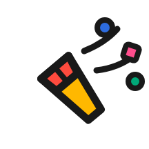
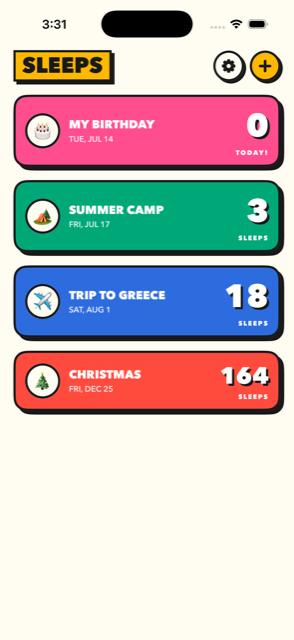
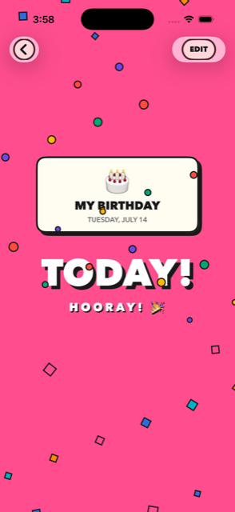
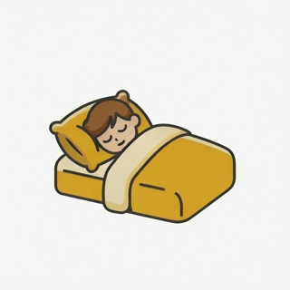

#  Sleeps

**"How long until August?" — a countdown app for kids.**

Every trip, my son asked Siri how many days were left until the fun stuff. Now the answer lives on his home screen — in *sleeps*, the only unit of time that matters when you're small.

| List | The big day | Icon |
|:---:|:---:|:---:|
|  |  |  |

## Features

- **Countdowns in sleeps** — big flashcard numerals a five-year-old can read across the room
- **Home screen widgets** — small (next event) and medium (next three), configurable to pin one; tapping opens the event via `sleeps://event/<id>` deep links
- **Siri** — *"How many sleeps until Summer Camp in Sleeps?"* via App Intents
- **Reminders** — local notifications at 7 / 3 / 1 days and the morning of, at a parent-chosen time (default 8:00 AM)
- **iCloud sync** — SwiftData + CloudKit private database across same-account devices; gracefully falls back to local-only when iCloud isn't available
- **Made-for-kids by design** — no ads, no analytics, no accounts, parental gate on external links

## Design

"Big & Loud": toy-box graphic design — flat saturated slabs, 3pt ink outlines, hard offset shadows, and Avenir Next Heavy numerals so big they're the interface. Tokens live in [`CountdownKit/Sources/CountdownKit/LoudTheme.swift`](CountdownKit/Sources/CountdownKit/LoudTheme.swift), the palette in [`EventColor.swift`](CountdownKit/Sources/CountdownKit/EventColor.swift).

## Stack

SwiftUI · SwiftData (CloudKit) · WidgetKit · App Intents · UserNotifications · iOS 17+

Tested on iOS Simulator (iPhone 17 Pro) and on a real iPhone 17 Pro Max running the iOS 27 developer beta.

## Layout

```
CountdownKit/       Swift package: model, calendar-day math, text, notification planner, theme
Countdown/          App target: views, notification scheduler, Siri shortcuts
CountdownWidget/    Widget extension (small + medium)
Shared/             App Intents entity + widget config intent (compiled into both targets)
docs/               Design spec + screenshots
project.yml         XcodeGen spec — source of truth; Countdown.xcodeproj is generated (gitignored)
```

## Build & run

Built with Xcode 26 (any Xcode with the iOS 17 SDK should work) and [XcodeGen](https://github.com/yonaskolb/XcodeGen) (`brew install xcodegen`).

```sh
xcodegen generate
open Countdown.xcodeproj        # then ⌘R, or:
xcodebuild -project Countdown.xcodeproj -scheme Countdown \
  -destination 'platform=iOS Simulator,name=iPhone 17 Pro' build
```

Unit tests (date math across DST boundaries, kid phrasing, notification planning — 24 tests):

```sh
cd CountdownKit && swift test
```

Dev sample data: launch with the `-seedSampleData` argument (DEBUG builds only; fills an empty store).

## The one rule of countdown math

"Days until" is **calendar days** — `startOfDay(now)` to `startOfDay(event)` — never `seconds / 86400`. Time-of-day and DST can't skew the number of sleeps. See [`DaysUntil.swift`](CountdownKit/Sources/CountdownKit/DaysUntil.swift) and its tests.

## Before App Store submission

- [ ] Host the privacy policy and update the URL in [`SettingsView.swift`](Countdown/Views/SettingsView.swift)
- [ ] App Store Connect: Made for Kids category (age band 6–8), privacy label "Data Not Collected"
- [ ] Screenshots + metadata, TestFlight, submit

Identifiers: bundle `com.iamilias.sleeps`, App Group `group.com.iamilias.sleeps`, CloudKit container `iCloud.com.iamilias.sleeps`. Signing team is set in `project.yml`; Xcode automatic signing registers the group and container on first device build.

## A note on Siri

Apple requires the app name inside third-party Siri phrases, so it's *"how long until August **in Sleeps**"* — not the bare phrase. That's why the app name is one short word.
